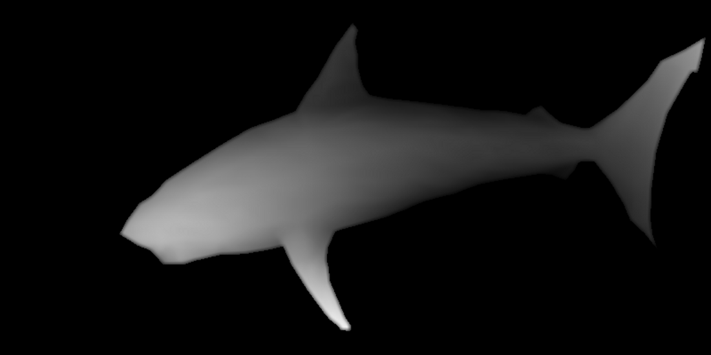

# Autostereogram
Software to create [Autostereograms](https://en.wikipedia.org/wiki/Autostereogram) starting from a b/w [depth map](https://en.wikipedia.org/wiki/Depth_map).

Implementation adopts [GTK3.x](https://developer.gnome.org/gtk3/3.0/) toolkit and [Cairo graphics](https://www.cairographics.org/) lib.

## Howto

#### Compilation (for linux system)
In source directory:
 
```bash
mkdir build
cd build
cmake ..
make
```
 
#### Run with:

```bash
./autostereogram -f path/to/depth_map.ext [-b random | striped]
```

#### Example (from build folder):

```bash
./autostereogram -f ../depth_maps/shark.png
```

Depth map:


Output:

